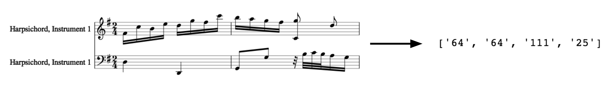

# Recognizing Composers Using High-Level Features

Automatic classification of classical music scores according to their composer, by applying methods common in text classification. Event durations and sequences of approximated chords are extracted from the dataset. Tf-idf values are computed for durations and chord n-grams, then used to build five composer classifier models: support vector machine, logistic regression, k-nearest neighbors, Naive Bayes and multilayer perceptron. The support vector machine is shown to work best in both two-class and multiclass settings.

Identifying the composer by listening to a piece of music is a task often associated with human knowledge of music. An entrance exam for the composition program of a conservatory will typically require the candidate to listen to a piece of music without knowing its composer or title, then to identify the stylistic elements as well as historical context pertinent to the composer of that piece. In other words, recognizing composers usually requires the combined knowledge of music theory and history.

This experiment tackles the previously mentioned task using machine learning methods. Without heavily relying on expert knowledge, this data-driven approach seeks to build accurate predictive classification models using features collected from labeled data given in the form of MIDI files. Specifically, it focuses on the usage of chords by each composer and applies methods common in information retrieval and text mining, such as n-grams and tf-idf values, to the classification of musical scores. In addition, the durations of notes, chords and rests are also considered as features.

Course project for Machine Learning ([Professor Robert M. Haralick](http://www.haralick.org), Graduate Center, CUNY, Spring 2017)

Keywords: music classification, high-level musical feature, chord n-grams, duration, machine learning, music21, scikit-learn.

TODO

- [x] Upload (processed) dataset
- [ ] Make code cleaner, add comments, etc
- [ ] Add pdf write-up
- [ ] Add instructions for MIDI conversion
- [ ] Translate to lang:ko?
